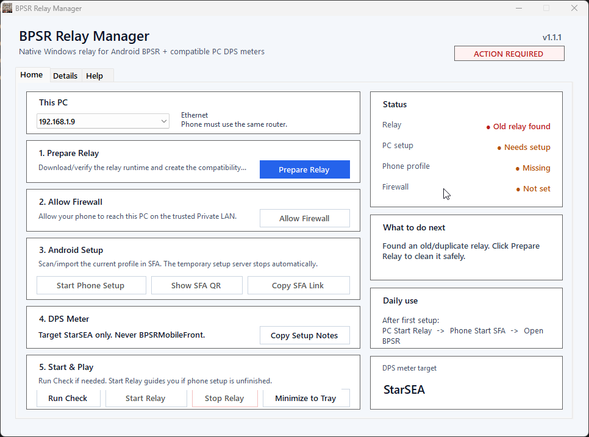

# BPSR Android DPSMeter Relay

Windows helper for using a **PC BPSR DPS meter with BPSR running on Android**.

[Download latest ZIP](https://github.com/Zudin987/BPSR-Android-DPSMeter-Relay/releases/latest) · [Project website](https://zudin987.github.io/projects/android-relay/) · [Report an issue](https://github.com/Zudin987/BPSR-Android-DPSMeter-Relay/issues)

  
   
  <em>BPSR Relay Manager</em>

## Requirements

- Windows PC and Android phone on the same trusted private network.
- SFA (sing-box for Android) on the phone.
- A separate compatible Windows BPSR DPS meter.
- Administrator approval for the manager's Windows firewall rule.

## Use

1. [Download the latest ZIP](https://github.com/Zudin987/BPSR-Android-DPSMeter-Relay/releases/latest/download/BPSR-Android-DPSMeter-Relay.zip).
2. Extract the whole ZIP and run `BPSR Relay Manager.exe`.
3. Select the PC Ethernet/Wi-Fi address connected to the same router as the phone.
4. Click **Prepare Relay** -> **Allow Firewall** -> **Start Phone Setup**.
5. In Android SFA, scan/import the QR profile and route **BPSR only** through it.
6. Click **Start Relay** on the PC, start SFA on the phone, then open BPSR.
7. In your compatible DPS meter, use **StarSEA** as the BPSR capture/process target.

Daily use is normally:

**PC Start Relay -> Android Start SFA -> Open BPSR**

Use **Minimize to Tray** when you want the manager out of the taskbar while keeping it available. The tray menu can reopen the manager, start/stop the relay, or exit the manager.

## Native Windows manager

`BPSR Relay Manager.exe` is a native C# WinForms manager. It directly owns the UI, system tray, single-instance restore, Windows network/firewall setup, relay process lifecycle, local SFA profile server, configuration generation and diagnostics.

The user release does **not** launch or ship PowerShell manager scripts. PowerShell files in the repository are developer/CI tooling only.

The actual gameplay traffic still uses the proven sing-box relay processes. Moving the manager to C# changes desktop lifecycle/reliability and lowers manager overhead; it does not replace the field-tested relay topology.

## Compatibility

The relay is **DPS-meter agnostic**: it forwards game traffic and does not calculate DPS itself. Use any compatible Windows meter that can parse BPSR traffic from **StarSEA**. Multiple compatible meters may observe the same stream.

The manager keeps normal setup on **Home**, troubleshooting on **Details**, and simple instructions on **Help**.

## Important

- Use only on a **trusted home/private LAN**.
- Do **not** port-forward relay port `10808` on your router.
- The phone -> PC hop uses **authenticated SOCKS5** but is not encrypted.
- Do **not** target `BPSRMobileFront` in the DPS meter; use **StarSEA**.
- Re-run phone setup if your PC LAN IP changes or the manager tells you to repair the profile.
- The SFA QR is generated locally on the PC; the setup payload is not sent to an external QR service.

The relay does not modify BPSR game files.

**Unofficial community tool.** Not affiliated with BPSR, SFA, sing-box, or any DPS-meter project.

## Troubleshooting

Use **Details** for connection diagnostics and **Help** for the setup sequence. If the phone cannot connect, confirm the PC LAN address, private-network firewall rule and imported SFA profile. If the meter has no data, check that its capture target is **StarSEA**.

Include the relay version, PC/phone connection type and meter name in a bug report. Do not post the phone setup QR profile or relay credentials.
